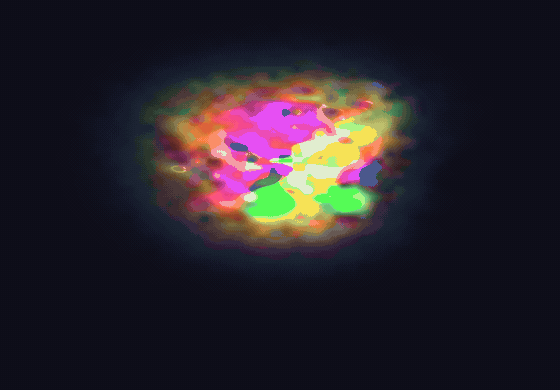

<div align="center">

# Local Rules

**An interactive essay on cellular automata — six universes built from a single rule, ending in a neural network that grows a creature from one pixel and heals it when you cut it.**

[](LICENSE)
[](https://www.typescriptlang.org/)
[](https://www.w3.org/TR/webgpu/)
[](https://vite.dev/)

**[▶ Live demo](https://local-rules-production.up.railway.app/)** · everything on the page is a real simulation, running live in your browser.



</div>

---

> Every cell looks at its neighbours and decides what to do. Everything else is emergent.

That one sentence is the whole essay. **Local Rules** follows it from the simplest rule anyone ever wrote — Conway's Game of Life, nine numbers on a chessboard — to the strangest: a neural network that was never told what a butterfly is, yet grows one from a single lit pixel and knits it back together after you drag your cursor straight through it (that's the loop above — grow, cut, heal, on repeat).

Six chapters, six real GPU simulations, one idea travelling the whole way:

**Conway → Rule space → Larger than Life → Lenia → Reaction–diffusion → Neural CA.**

Nothing here is a recording. Every universe is written in WGSL and runs live as you scroll — you turn the parameters, cut the creatures, and a shareable URL round-trips the exact configuration you landed on.

## The one I trained

The finale is a [neural cellular automaton](https://distill.pub/2020/growing-ca/): a tiny network — **8,336 numbers, 33 kilobytes, smaller than a screenshot of the creature it grows** — run by every cell in parallel, each seeing only its eight neighbours. There is no sprite, no video, no repair routine anywhere in the page. The shape is stored nowhere; it re-emerges, every time, from local negotiations, and it heals because it was trained *while being damaged* — wounded thousands of times, scored only on what grew back.

I trained eight creatures on an RTX 4070 Ti. The method is [Mordvintsev et al.](https://distill.pub/2020/growing-ca/)'s; the weights, the scars and the survivors are mine.

## Measured, not claimed

The project has a rule of its own: **no invented benchmarks.** Every number below was taken on real hardware, and anything unmeasured is written `—`, never faked.

**Conway** — Apple M-series, Metal 3, CPU-side wall clock:

| grid | throughput |
|:--|--:|
| 512² | 5.1 × 10⁹ cells/s |
| 1024² | 5.7 × 10⁹ cells/s |
| 2048² | 5.8 × 10⁹ cells/s |

**Neural CA** — 8,336 parameters · 33.3 KB on disk · a 48 → 128 → 16 network · 1.6 ms sim / 9.4 ms post per frame (Metal 3).
**FFT vs direct convolution** — crossover at **R\* ≈ 8–9**; the Stockham FFT wins 2.3–2.6× at Lenia's R=13.

And the honest part — the bestiary under a cursor. Regeneration IoU after the essay's scripted bite, then the median and *worst-case* IoU under a seeded slow-drag gauntlet. The worst column is shown on purpose: a median that hides a catastrophic seed is a lie of omission.

| creature | heals a cut | survives slow drag-cuts |
|:--|:--:|:--:|
| 🦋 butterfly | 99.6% | 95.1% · worst 78% |
| ❤️ heart | 94.3% | 78.2% · worst 56% |
| 🦎 lizard | 99.6% | 89.4% · worst 51% |
| 🍄 mushroom | 99.9% | 95.2% · worst 64% |
| ⭐ star | 98.4% | 94.8% · worst 16% |
| 👽 alien | 99.8% | 98.4% · worst 94% |
| 👻 ghost | 98.0% | 88.1% · worst 71% |
| 🌼 flower | 99.6% | 87.7% · worst 40% |

Alien is bombproof; star is a diva. Both are true, and the page shows you which is which.

## The engines are checked, not trusted

`npm run test:engine` runs **12 gates** in a headless browser: Conway invariants and arbitrary-rule equality against a CPU reference, Larger-than-Life against Golly, Lenia and Gray–Scott CPU-parity, the 64-rule explorer, and WGSL-vs-Python FFT-convolution parity within tolerance. If an engine drifts, the gate fails.

## Running locally

```bash
npm install
npm run dev          # http://localhost:5173 — needs a WebGPU-capable browser
```

```bash
npm run build        # production build → dist/
npm run typecheck    # tsc --noEmit
npm run test:engine  # the 12 headless WebGPU gates
```

> WebGPU needs a secure context: `localhost` and any `https://` deploy work out of the box. Where it is unavailable, the essay degrades to a readable static document.

## Deploy

Containerised and ready for [Railway](https://railway.app) or any Docker host — `railway.json` selects the Dockerfile and the container serves the static build on `$PORT`:

```bash
docker build -t local-rules .
docker run -p 8080:8080 local-rules   # → http://localhost:8080
```

## Built with

**TypeScript · WebGPU (WGSL) for every simulation and render · Vite.** The training pipeline is Python (PyTorch); its output is committed as static weights. Motion runs on GSAP + Lenis, and a `ChapterVisual` seam lets the real engines swap in behind the design.

## Credits

Standing on giants — Conway's Game of Life (1970), Larger than Life (Evans), **Lenia** ([Bert Chan, 2019](https://arxiv.org/abs/1812.05433)), reaction–diffusion (Turing 1952 · Gray–Scott · Pearson), and **Growing Neural Cellular Automata** ([Mordvintsev et al., Distill 2020](https://distill.pub/2020/growing-ca/)).

## License

[MIT](LICENSE) © 2026 Joaquín Godoy
